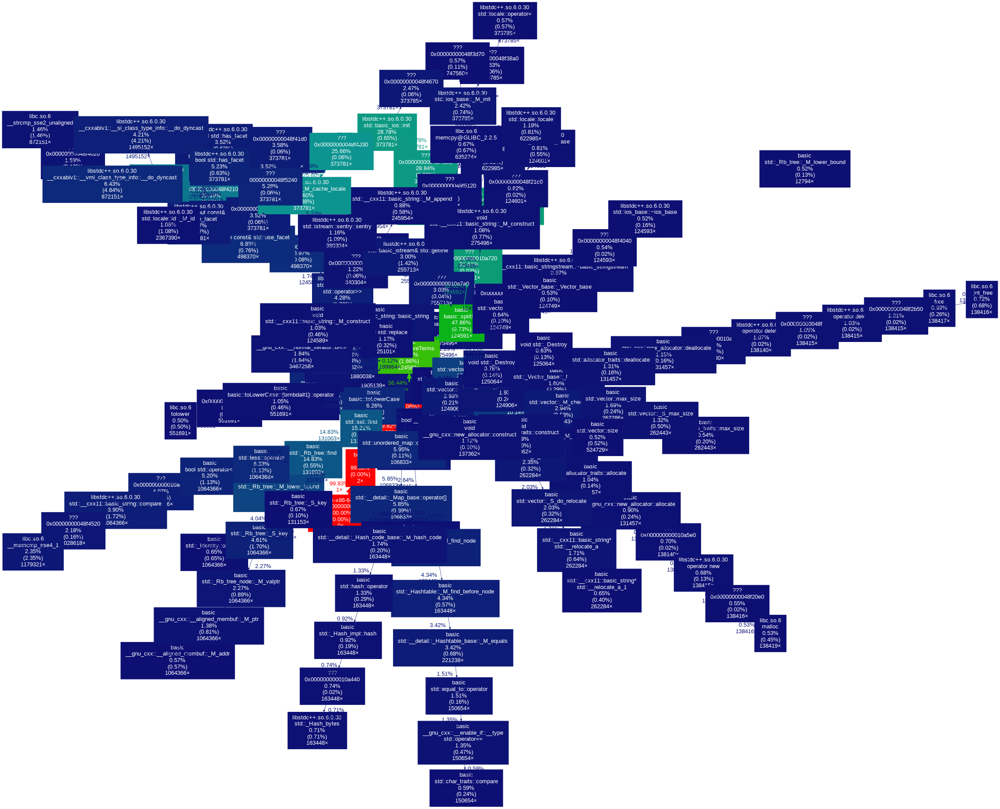
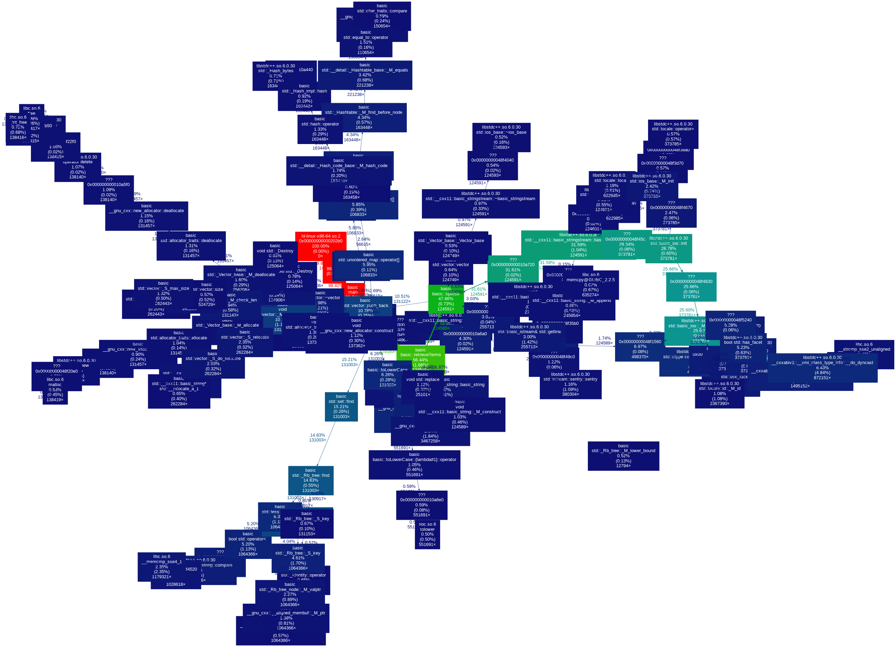

# Dynamic Call Graph

- This repository contains hands-on examples to visualize dynamic call graphs.
- Examples visualize dynamic call graph of c/c++ programs using [callgrind](https://valgrind.org/docs/manual/cl-manual.html), [gprof2dot](https://github.com/jrfonseca/gprof2dot) and [graphviz](https://graphviz.org).

## Example 1

```shell
python3 create_callgrind_output.py ./pride_and_prejudice.txt
python3 gprof2img.py ./pride_and_prejudice.txt
```

## Example 2

```shell
python3 create_callgrind_output.py ./lorem_ipsum.txt
python3 gprof2img.py ./lorem_ipsum.txt
```

## Result

- When you run above script, you will get following images.
- These images created by [graphviz](https://graphviz.org/)

## Dot Layout



## SFDP Layout

